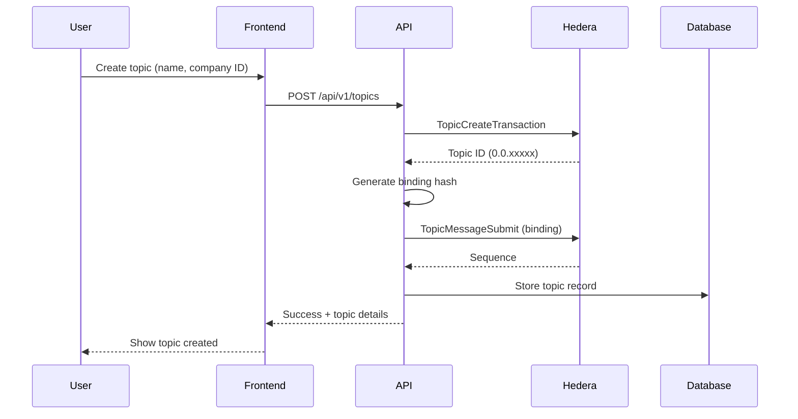
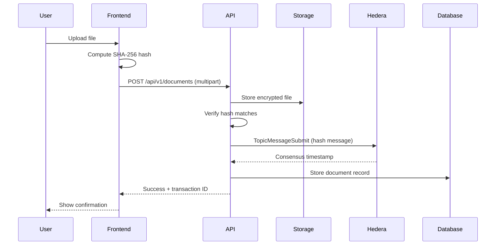
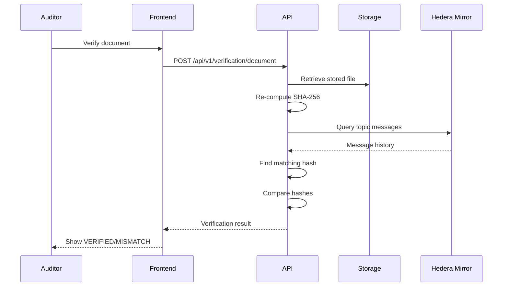

# GlyphHash Architecture

## Overview

GlyphHash is a **serverless-first, microservices-oriented** compliance auditing platform built on Hedera blockchain. This document outlines the technical architecture and design decisions.

## System Architecture

```
┌─────────────────────────────────────────────────────────────────────────────┐
│                              CLIENT LAYER                                    │
├─────────────────────────────────────────────────────────────────────────────┤
│  Next.js 14 Frontend                                                         │
│  ├── App Router (Server Components + Client Components)                      │
│  ├── Petroglyph-inspired UI (TailwindCSS)                                   │
│  ├── Real-time updates (planned: WebSockets/SSE)                            │
│  └── Client-side file hashing (Web Crypto API)                              │
└────────────────────────────────┬────────────────────────────────────────────┘
                                 │ HTTPS / REST
                                 ▼
┌─────────────────────────────────────────────────────────────────────────────┐
│                              API LAYER                                       │
├─────────────────────────────────────────────────────────────────────────────┤
│  Express.js API Gateway                                                      │
│  ├── Topic Routes:       POST/GET /api/v1/topics                            │
│  ├── Document Routes:    POST/GET /api/v1/documents                         │
│  ├── Verification Routes: POST/GET /api/v1/verification                     │
│  ├── Middleware: CORS, Helmet, Rate Limiting, Validation (Zod)              │
│  └── Error Handling: Structured errors with codes                           │
└─────────┬───────────────────────┬───────────────────────┬───────────────────┘
          │                       │                       │
          ▼                       ▼                       ▼
┌─────────────────┐    ┌─────────────────┐    ┌─────────────────────────────┐
│    PostgreSQL   │    │  File Storage   │    │     Hedera Network          │
│    (Prisma)     │    │  (Local/S3)     │    │                             │
├─────────────────┤    ├─────────────────┤    ├─────────────────────────────┤
│ • Topics        │    │ • Encrypted     │    │ HCS (Consensus Service)     │
│ • Documents     │    │   documents     │    │ • Topic creation            │
│ • Audit Logs    │    │ • Organized by  │    │ • Message submission        │
│ • Verification  │    │   date paths    │    │ • Immutable ordering        │
│   Reports       │    │                 │    │                             │
└─────────────────┘    └─────────────────┘    │ Mirror Node (Query)         │
                                              │ • Message retrieval         │
                                              │ • Topic info                │
                                              └─────────────────────────────┘
```

## Core Components

### 1. Frontend (Next.js 14)

**Location:** `apps/web/`

- **Framework:** Next.js 14 with App Router
- **Styling:** TailwindCSS with petroglyph-inspired theme
- **State:** React hooks + API client
- **Features:**
  - Server-side rendering for SEO
  - Client-side file hashing (Web Crypto API)
  - Responsive dashboard
  - Demo flow for shareholders

### 2. API Gateway (Express.js)

**Location:** `apps/api/`

- **Framework:** Express.js with TypeScript
- **Database:** PostgreSQL via Prisma ORM
- **Validation:** Zod schemas
- **Error Handling:** Structured error classes

**Endpoints:**
| Endpoint | Method | Description |
|----------|--------|-------------|
| `/api/v1/topics` | POST | Create new Hedera topic |
| `/api/v1/topics` | GET | List user's topics |
| `/api/v1/topics/:id` | GET | Get topic details |
| `/api/v1/topics/:id/messages` | GET | Get Hedera messages |
| `/api/v1/documents` | POST | Upload & hash document |
| `/api/v1/documents` | GET | List documents |
| `/api/v1/documents/:id` | GET | Get document details |
| `/api/v1/verification/document` | POST | Verify single document |
| `/api/v1/verification/batch` | POST | Batch verify topic |

### 3. Hedera Integration

**Location:** `packages/hedera/`

**Services:**
- **TopicService:** Creates topics, submits messages
- **MirrorNodeService:** Queries message history

**Message Format (HCS):**
```typescript
interface HashMessage {
  type: 'TOPIC_BINDING' | 'DOCUMENT_HASH' | 'VERSION_LINK';
  version: '1.0';
  timestamp: string; // ISO 8601
  payload: TopicBindingPayload | DocumentHashPayload;
}
```

### 4. Shared Types

**Location:** `packages/types/`

Shared TypeScript interfaces for:
- Topics
- Documents
- Verification results
- API responses

## Data Flows

### Flow 1: Topic Creation (Business Setup)



### Flow 2: Document Upload & Hashing



### Flow 3: Auditor Verification



## Security Considerations

### Current (MVP)
- Helmet.js for HTTP security headers
- CORS configuration
- Input validation (Zod)
- Structured error handling (no stack traces in production)

### Planned (Production)
- Auth0 authentication with JWT
- Role-based access control (ADMIN, USER, AUDITOR)
- AES-256-GCM file encryption
- Rate limiting (100 req/min)
- Audit logging

## Database Schema

```prisma
model Topic {
  id                String   @id @default(uuid())
  topicId           String   @unique // Hedera topic ID
  name              String
  description       String?
  ownerId           String
  companyIdentifier String
  bindingHash       String
  bindingTimestamp  DateTime?
  documents         Document[]
}

model Document {
  id                 String         @id @default(uuid())
  topicId            String
  filename           String
  originalName       String
  hash               String         // SHA-256
  storagePath        String
  status             DocumentStatus
  sequenceNumber     Int?
  consensusTimestamp DateTime?
  transactionId      String?
  category           DocumentCategory
  version            Int            @default(1)
}

model VerificationReport {
  id             String @id @default(uuid())
  topicId        String
  totalDocuments Int
  verified       Int
  mismatches     Int
  results        Json
}
```

## Technology Choices

| Component | Technology | Rationale |
|-----------|------------|-----------|
| Frontend | Next.js 14 | SSR, App Router, excellent DX |
| Backend | Express.js | Lightweight, ecosystem, Hedera SDK |
| Database | PostgreSQL | ACID, JSONB, mature |
| ORM | Prisma | Type-safe, migrations, DX |
| Blockchain | Hedera HCS | Low fees, fast finality, enterprise |
| Styling | TailwindCSS | Utility-first, design system |
| Validation | Zod | Runtime + TypeScript inference |
| Testing | Jest | Standard, mocking support |

## Scalability Path

### Phase 1: MVP (Current)
- Single API server
- Local file storage
- Testnet only

### Phase 2: Production
- AWS S3 for storage
- Redis for caching
- PostgreSQL RDS
- Mainnet deployment

### Phase 3: Enterprise
- Kubernetes deployment
- Auto-scaling
- Multi-region
- Event-driven architecture
